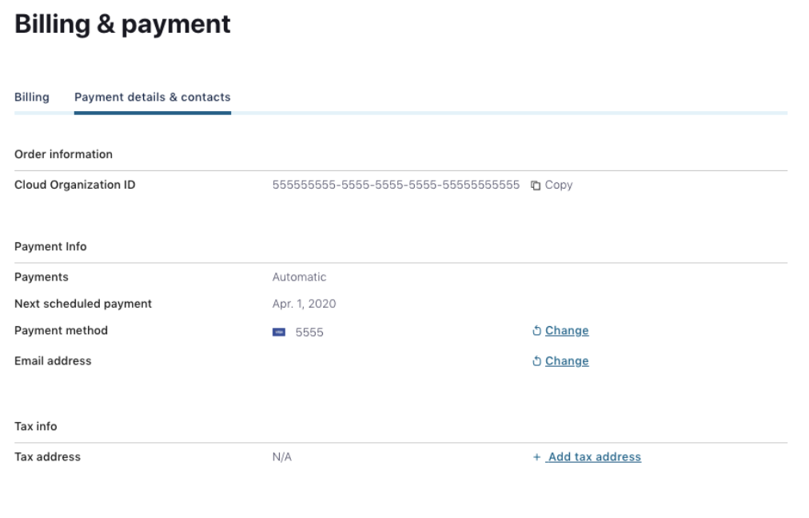
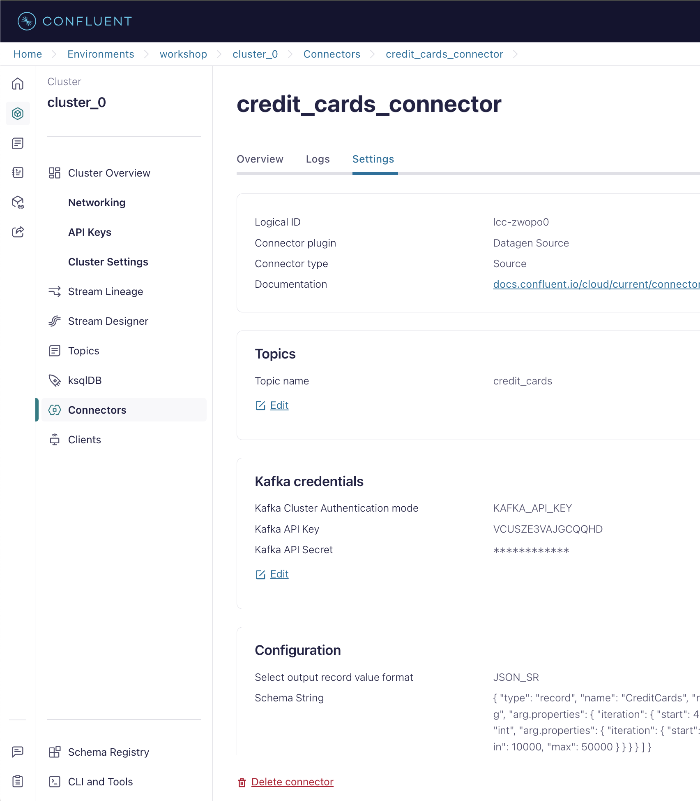

<div align="center" padding=25px>
    
</div>

# <div align="center">Build Fraud Detection with Confluent Cloud and Flink</div>
## <div align="center">Lab Guide</div>
<br>

## **Agenda**
1. [Log into Confluent Cloud](#step-1)
2. [Create an Environment and Cluster](#step-2)
3. [Create Flink Compute Pool](#step-3)
4. [Create Topics and walk through Confluent Cloud Dashboard](#step-4)
5. [Create Datagen Connectors for Customers and Credit Cards](#step-5)
6. [Perform complex joins using Flink to combine the records into one topic](#step-6)
7. [Flink Monitoring](#step-7)
8. [Clean Up Resources](#step-8)
9. [Confluent Resources and Further Testing](#step-9)
***

## **Prerequisites**
<br>

1. Create a Confluent Cloud Account.
    - Sign up for a Confluent Cloud account [here](https://www.confluent.io/confluent-cloud/tryfree/).
    - Once you have signed up and logged in, click on the menu icon at the upper right hand corner, click on “Billing & payment”, then enter payment details under “Payment details & contacts”. A screenshot of the billing UI is included below.

2. Clone this repo:
   ```
   git clone git@github.com:confluentinc/commercial-workshops.git
   ```
   or
   ```
   git clone https://github.com/confluentinc/commercial-workshops.git
   ```

3. Install confluent cloud CLI based on your OS (https://docs.confluent.io/confluent-cli/current/install.html)

> **Note:** You will create resources during this workshop that will incur costs. When you sign up for a Confluent Cloud account, you will get free credits to use in Confluent Cloud. This will cover the cost of resources created during the workshop. More details on the specifics can be found [here](https://www.confluent.io/confluent-cloud/tryfree/).

<div align="center" padding=25px>
    
</div>

***

## **Objective**

<br>

Welcome to “Build Predictive Machine Learning Models Using Streaming Data Pipelines”! In this workshop, you will discover how to leverage the capabilities of Confluent Cloud to enable the development of predictive machine learning models using streaming data. We will focus on showcasing how Confluent Cloud, along with Apache Flink and Kafka, can facilitate the creation and deployment of effective data pipelines for real-time analytics.

By the end of this workshop, you'll have a clear understanding of how to utilize Confluent Cloud’s features to build a foundation for machine learning applications, empowering you to transform your streaming data into valuable predictions and insights.

***


## <a name="step-1"></a>Log into Confluent Cloud

1. Log into [Confluent Cloud](https://confluent.cloud) and enter your email and password.

<div align="center" padding=25px>
    
</div>

2. If you are logging in for the first time, you will see a self-guided wizard that walks you through spinning up a cluster. Please minimize this as you will walk through those steps in this workshop. 

***

## <a name="step-2"></a>Create an Environment and Cluster

An environment contains clusters and its deployed components such as Apache Flink, Connectors, ksqlDB, and Schema Registry. You have the ability to create different environments based on your company's requirements. For example, you can use environments to separate Development/Testing, Pre-Production, and Production clusters. 

1. Click **+ Add Environment**. Specify an **Environment Name** and Click **Create**. 

>**Note:** There is a *default* environment ready in your account upon account creation. You can use this *default* environment for the purpose of this workshop if you do not wish to create an additional environment.

<div align="center" padding=25px>
    
</div>

2. Now that you have an environment, click **Create Cluster**. 

> **Note:** Confluent Cloud clusters are available in 3 types: Basic, Standard, and Dedicated. Basic is intended for development use cases so you will use that for the workshop. Basic clusters only support single zone availability. Standard and Dedicated clusters are intended for production use and support Multi-zone deployments. If you are interested in learning more about the different types of clusters and their associated features and limits, refer to this [documentation](https://docs.confluent.io/current/cloud/clusters/cluster-types.html).

3. Chose the **Basic** cluster type. 

<div align="center" padding=25px>
    
</div>

4. Click **Begin Configuration**. 
5. Choose your preferred Cloud Provider (AWS, GCP, or Azure), region, and availability zone. 
6. Specify a **Cluster Name**. For the purpose of this lab, any name will work here. 

<div align="center" padding=25px>
    
</div>

7. View the associated *Configuration & Cost*, *Usage Limits*, and *Uptime SLA* information before launching. 
8. Click **Launch Cluster**. 

***

## <a name="step-3"></a>Create a Flink Compute Pool

1. On the navigation menu, select **Flink** and click **Create Compute Pool**.

<div align="center" padding=25px>
    
</div>

2. Select **Region** and then **Continue**. (You have to use the region where the cluster was created in the previous step)
<div align="center" padding=25px>
    
</div>

3. Name you Pool Name and set the capacity units (CFUs) to **5**. Click **Finish**.

<div align="center" padding=25px>
    
</div>

> **Note:** The capacity of a compute pool is measured in CFUs. Compute pools expand and shrink automatically based on the resources required by the statements using them. A compute pool without any running statements scale down to zero. The maximum size of a compute pool is configured during creation. 

4. Flink Compute pools will be ready shortly. You can click **Open SQL workspace** when the pool is ready to use.

5. Change your workspace name by clicking **settings button**. Click **Save changes** after you update the workspace name.

<div align="center" padding=25px>
    
</div>

6. Set the Catalog as your environment name.

<div align="center" padding=25px>
    
</div>

7. Set the Database as your cluster name.

<div align="center" padding=25px>
    
</div>

***

## <a name="step-4"></a>Creates Topic and Walk Through Cloud Dashboard

1. On the navigation menu, you will see **Cluster Overview**. 

> **Note:** This section shows Cluster Metrics, such as Throughput and Storage. This page also shows the number of Topics, Partitions, Connectors, and ksqlDB Applications.

2. Click on **Cluster Settings**. This is where you can find your *Cluster ID, Bootstrap Server, Cloud Details, Cluster Type,* and *Capacity Limits*.
3. On the same navigation menu, select **Topics** and click **Create Topic**. 
4. Enter **customers** as the topic name, **3** as the number of partitions, skip the data contract and then click **Create with defaults**.'

<div align="center" padding=25px>
    
</div>

5. Repeat the previous step and create a second topic name **credit_cards** and **3** as the number of partitions and skip the data contract.

6. Repeat the previous step and create a third topic name **transactions** and **3** as the number of partitions and skip the data contract.

> **Note:** Topics have many configurable parameters. A complete list of those configurations for Confluent Cloud can be found [here](https://docs.confluent.io/cloud/current/using/broker-config.html). If you are interested in viewing the default configurations, you can view them in the Topic Summary on the right side. 

7. After topic creation, the **Topics UI** allows you to monitor production and consumption throughput metrics and the configuration parameters for your topics. When you begin sending messages to Confluent Cloud, you will be able to view those messages and message schemas.

***

## <a name="step-5"></a>Create Datagen Connectors for Customers and Credit Cards
The next step is to produce sample data using the Datagen Source connector. You will create two Datagen Source connectors. One connector will send sample customer data to **customers** topic, the other connector will send sample credit card data to **credit_cards** topic.

1. First, you will create the connector that will send data to **customers**. From the Confluent Cloud UI, click on the **Connectors** tab on the navigation menu. Click on the **Datagen Source** icon.

<div align="center" padding=25px>
    
</div>

2. Click **Additional Configuration** button.
<div align="center" padding=25px>
    
</div>

3. Choose **customers** topic.
<div align="center" padding=25px>
    
</div>

4. Click **Generate API Key and Download** and give any description. The API key would be downloaded and would be available in the downloads folder in the system
<div align="center" padding=25px>
    
</div>

5. Choose **AVRO** for select output record value format.
<div align="center" padding=25px>
    
</div>

6. Click on **Provide Your Own Schema** and paste the following contents
```
{
  "type": "record",
  "name": "CustomerRecord",
  "namespace": "workshop_5",
  "fields": [
    {
      "name": "customer_id",
      "type": {
        "type": "int",
        "arg.properties": {
          "iteration": {
            "start": 100
          }
        }
      }
    },
    {
      "name": "customer_email",
      "type": {
        "type": "string",
        "arg.properties": {
          "options": [
            "alex.jose@gmail.com",
            "james.joe@gmail.com",
            "john.doe@gmail.com",
            "lisa.kudrow@gmail.com",
            "jeniffer.aniston@gmail.com",
            "ross.geller@gmail.com",
            "joey.tribbiani@gmail.com",
            "courtney.cox@gmail.com"
          ]
        }
      }
    },
    {
      "name": "average_spending_amount",
      "type": {
        "type": "int",
        "arg.properties": {
          "range": {
            "min": 1000,
            "max": 1500
          }
        }
      }
    }
  ]
}
```
7. Click on **Continue**, Sizing should be good, click on **Continue** again. You can name the connector anything or leave it as default and click on **Continue**.
<div align="center" padding=25px>
    
</div>


8. After few seconds Connector would be provisioned and running. Check for messages in the **customers** topic by navigating to the topics section.
9. Repeat the same steps to create a connector for **credit_cards** topic by using the below schema but use existing API key this time.
```
{
  "type": "record",
  "name": "CreditCards",
  "namespace": "workshop_5",
  "fields": [
    {
      "name": "credit_card_number",
      "type": {
        "type": "long",
        "arg.properties": {
          "iteration": {
            "start": 4738273984732749,
            "step": 749384739937
          }
        }
      }
    },
    {
      "name": "customer_id",
      "type": {
        "type": "int",
        "arg.properties": {
          "iteration": {
            "start": 100
          }
        }
      }
    },
    {
      "name": "maximum_limit",
      "type": {
        "type": "int",
        "arg.properties": {
          "range": {
            "min": 10000,
            "max": 50000
          }
        }
      }
    }
  ]
}
```
<div align="center" padding=25px>
    
</div>

<div align="center" padding=25px>
    
</div>

10. Repeat again the same steps to create a connector for **transactions** topic by using the below schema but use existing API key this time.
```
{
  "type": "record",
  "name": "TransactionRecord",
  "namespace": "workshop_5",
  "fields": [
    {
      "name": "amount",
      "type": {
        "type": "int",
        "arg.properties": {
          "range": {
            "min": 500,
            "max": 2000
          }
        }
      }
    },
    {
      "name": "credit_card_number",
      "type": {
        "type": "long",
        "arg.properties": {
          "options": [
             4774993836989662,
             4738273984732749,
             4739023369472686,
             4742020908432434,
             4743519677912308,
             4757008603231174,
             4751762910051615,
             4754760449011363,
             4760755526930859
          ]
        }
      }
    },
    {
      "name": "location",
      "type": {
        "type": "string",
        "arg.properties": {
          "options": [
             "Tokyo",
             "Rio",
             "Berlin",
             "Oslo",
             "Stockholm",
             "Nairobi",
             "Spain",
             "Portugal"
          ]
        }
      }
    },
    {
      "name": "transaction_id",
      "type": {
        "type": "int",
        "arg.properties": {
          "range": {
            "min": 1000000,
            "max": 9999999
          }
        }
      }
    },
    {
      "name": "event_timestamp",
      "type": {
        "type": "long",
        "arg.properties": {
          "iteration": {
            "start": 1753200000000,
            "step": 1000
          }
        }
      }
    }
  ]
}
```

> **Note:** If the connectors fails, there are a few different ways to troubleshoot the error:
> * Click on the *Connector Name*. You will see a play and pause button on this page. Click on the play button.
> * Click on the *Connector Name*, go to *Settings*, and re-enter your API key and secret. Double check there are no extra spaces at the beginning or end of the key and secret that you may have accidentally copied and pasted.
> * If neither of these steps work, try creating another Datagen connector.


11. You can view the sample data flowing into topics in real time. Navigate to  the **Topics** tab and then click on the **customers**, **credit_cards**, and **transactions**. You can view the production and consumption throughput metrics here.

12. Click on **Messages**.

* You should now be able to see the messages within the UI. You can view the specific messages by clicking the icon.
***

## <a name="step-6"></a>Perform complex joins using Flink to combine the records into one topic
Kafka topics and schemas are always in sync with our Flink cluster. Any topic created in Kafka is visible directly as a table in Flink, and any table created in Flink is visible as a topic in Kafka. Effectively, Flink provides a SQL interface on top of Confluent Cloud.

1. From the Confluent Cloud UI, click on the **Environments** tab on the navigation menu. Choose your environment.
2. Click on *Flink* from the menu pane
3. Choose the compute pool created in the previous steps.
4. Click on **Open SQL workspace** button on the top right.
5. Create an **aggregated_transactions** table by running the following SQL query.
```sql
CREATE TABLE aggregated_transactions (
    transaction_id INT NOT NULL PRIMARY KEY NOT ENFORCED,
    credit_card_number BIGINT,
    customer_email STRING,
    total_amount INT,
    average_spending_amount INT,
    transaction_timestamp TIMESTAMP(3),
    WATERMARK FOR transaction_timestamp AS transaction_timestamp - INTERVAL '1' SECOND
) WITH (
    'changelog.mode' = 'upsert'
);
```

6. Add a new query by clicking on + icon in the left of previous query to Insert records to the above table by running the following query.
```sql
INSERT INTO aggregated_transactions
SELECT 
    t.transaction_id,
    t.credit_card_number,
    cust.customer_email,
    t.amount,
    cust.average_spending_amount,
    TO_TIMESTAMP_LTZ(t.event_timestamp,3) AS transaction_timestamp
FROM transactions t
INNER JOIN credit_cards cc ON t.credit_card_number = cc.credit_card_number
INNER JOIN customers cust ON cc.customer_id = cust.customer_id
```
7. Now we will create a ```feature_set``` topic to put all the transactions in specific windows. To perform the same run the following query.
```sql
CREATE TABLE feature_set (
    credit_card_number BIGINT PRIMARY KEY NOT ENFORCED,
    customer_email STRING,
    total_amount INT,
    transaction_count BIGINT,
    average_spending_amount INT,
    window_start TIMESTAMP(3),
    window_end TIMESTAMP(3)
) WITH (
  'changelog.mode' = 'upsert'
)
```
```sql
INSERT INTO feature_set
  WITH windowed_transactions AS (
SELECT 
    credit_card_number,
    SUM(total_amount) AS total_amount,
    COUNT(transaction_id) AS transaction_count,
    window_start,
    window_end
FROM 
  TABLE(
    TUMBLE(TABLE aggregated_transactions, DESCRIPTOR(transaction_timestamp),INTERVAL '10' MINUTES)
  )
GROUP BY credit_card_number, window_start,window_end
)
SELECT DISTINCT
  t.credit_card_number,
  t.customer_email,
  wt.total_amount,
  wt.transaction_count,
  t.average_spending_amount,
  wt.window_start,
  wt.window_end
 FROM 
  aggregated_transactions t
 JOIN
   windowed_transactions wt
 ON
  wt.credit_card_number = t.credit_card_number
 AND
  t.transaction_timestamp BETWEEN wt.window_start AND wt.window_end
```

Windows are central to processing infinite streams. Windows split the stream into “buckets” of finite size, over which you can apply computations. This document focuses on how windowing is performed in Confluent Cloud for Apache Flink and how you can benefit from windowed functions.

Flink provides several window table-valued functions (TVF) to divide the elements of your table into windows, including:

a. [Tumble Windows](https://docs.confluent.io/cloud/current/flink/reference/queries/window-tvf.html#flink-sql-window-tvfs-tumble)
<br> 
b. [Hop Windows](https://docs.confluent.io/cloud/current/flink/reference/queries/window-tvf.html#flink-sql-window-tvfs-hop)
<br> 
c. [Cumulate Windows](https://docs.confluent.io/cloud/current/flink/reference/queries/window-tvf.html#flink-sql-window-tvfs-cumulate)
<br> 

## <a name="step-7"></a>Flink Monitoring
1. Status of all the Flink Jobs is available under **Flink Statements** Tab.
   
<div align="center">
    
</div>

2. Utilization information.
<div align="center">
    
</div>

<br> 


***

## <a name="step-8"></a>Clean Up Resources

Deleting the resources you created during this workshop will prevent you from incurring additional charges. 

1. The first item to delete is the Apache Flink Compute Pool. Select the **Delete** button under **Actions** and enter the **Application Name** to confirm the deletion. 
<div align="center">
    
</div>

2. Next, delete the Datagen Source connectors for **credit_cards_connector**, **customers_connector**. Navigate to the **Connectors** tab and select each connector. In the settings tab, you will see a **trash** icon on the bottom of the page. Click the icon and enter the **Connector Name**.
<div align="center">
    
</div>

3. Next, under **Cluster Settings**, select the **Delete Cluster** button at the bottom. Enter the **Cluster Name** and select **Confirm**. 
<div align="center">
    
</div>

4. Finally, to remove all resource pertaining to this workshop, delete the environment **workshop**.
<div align="center">
    
</div>
*** 

## <a name="step-9"></a>Confluent Resources and Further Testing

Here are some links to check out if you are interested in further testing:
- [Confluent Cloud Documentation](https://docs.confluent.io/cloud/current/overview.html)
- [Apache Flink 101](https://developer.confluent.io/courses/apache-flink/intro/)
- [Stream Processing with Confluent Cloud for Apache Flink](https://docs.confluent.io/cloud/current/flink/index.html)
- [Flink SQL Reference](https://docs.confluent.io/cloud/current/flink/reference/overview.html)
- [Flink SQL Functions](https://docs.confluent.io/cloud/current/flink/reference/functions/overview.html)

***
